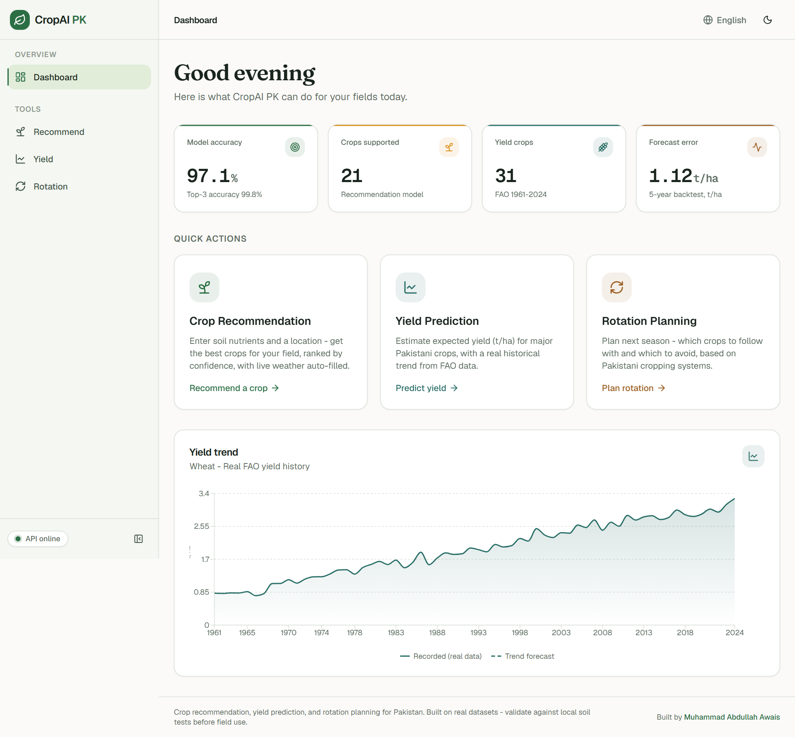
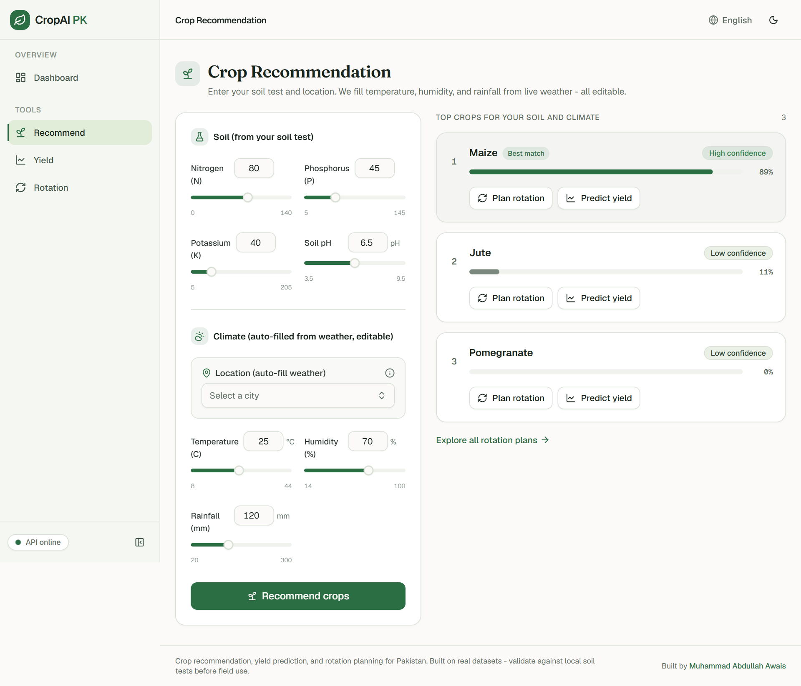
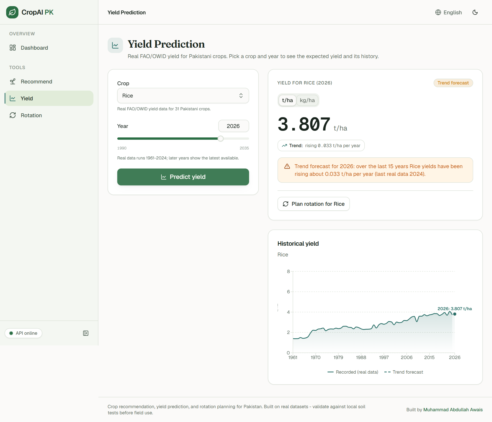
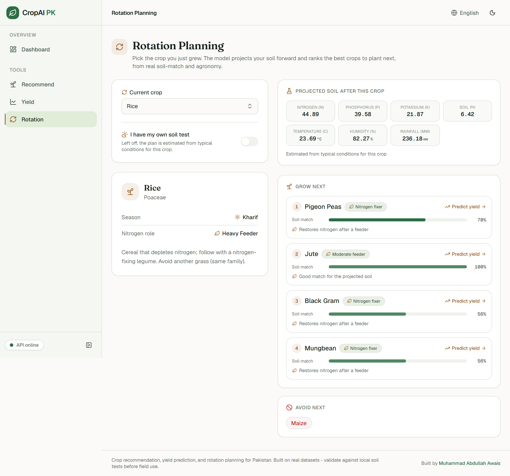
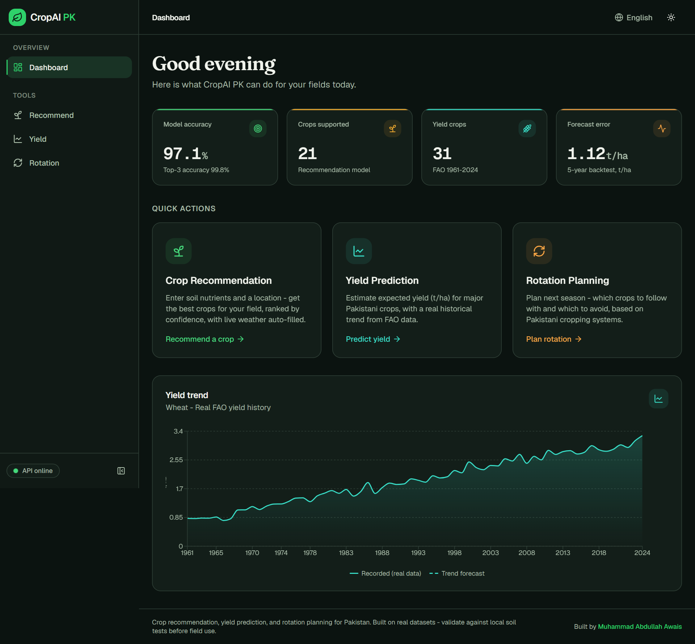
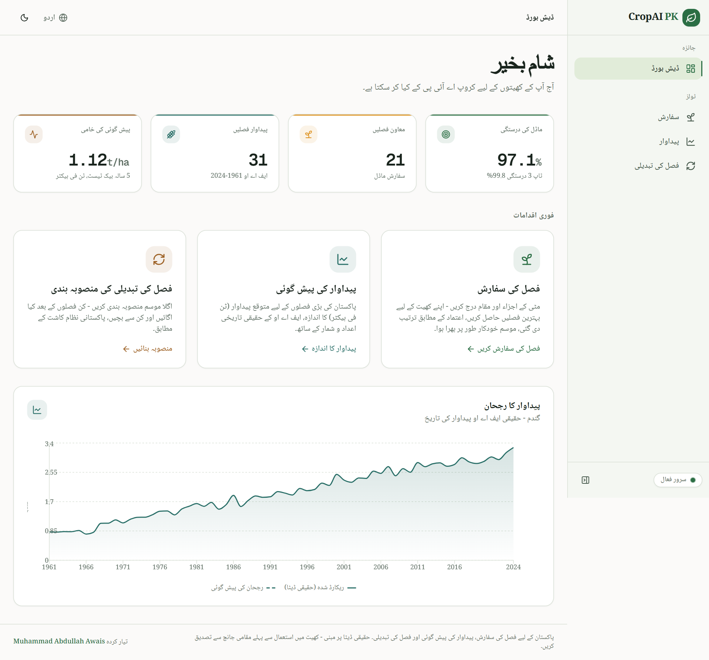

<p align="center">
  
</p>

<p align="center">
  
  
  
  
  
  
</p>

# CropAI PK

A web app that helps with three everyday farming decisions in Pakistan:

1. **Which crop should I plant?** (crop recommendation)
2. **How much will it yield?** (yield prediction)
3. **What should I plant next?** (rotation planning)

You fill in a short form, and a machine learning model gives you a clear answer in seconds.
The whole interface works in **English**, **Urdu** (right to left), and **Hindi**, with a
light and dark theme. Everything is built on **real, public agricultural data**. No
synthetic or made-up rows anywhere.

---

## Screenshots

A responsive dashboard interface with a full dark theme and three languages
(English, Urdu with right-to-left layout, and Hindi).

|  |  |
| :---: | :---: |
| **Dashboard** | **Crop recommendation** |
|  |  |
| **Yield prediction** | **Rotation planning** |
|  |  |
| **Dark mode** | **Urdu (right to left)** |
|  |  |

---

## What it does

### 1. Crop recommendation
Enter your soil nutrients (N, P, K, pH) and a location. The app auto-fills the current
temperature, humidity, and recent rainfall from a live weather API, then a scaled
**K-Nearest-Neighbours** classifier ranks the best crops for your field, each with a
confidence score. Covers **21 crops**.

### 2. Yield prediction
Pick a crop and a year. You get the expected yield (tonnes per hectare) from real Pakistan
harvest records (**1961 to 2024**), plus a history chart. Past years return the recorded
value; future years return a per-crop **trend forecast**, clearly labelled as an estimate.
Covers **31 crops**, including every crop the recommender can suggest.

### 3. Rotation planning
Pick the crop you just grew, and the app ranks the best crops to plant next (and the ones
to avoid). This is **not a static lookup**. It takes your soil, projects it forward using
the current crop's real nutrient effect (a legume leaves nitrogen behind, a cereal depletes
it), scores every candidate against that projected soil, and blends in agronomy rules
(never repeat the same plant family, favour a legume after a heavy feeder). You can enter
your own soil-test numbers for a personalised result, or leave them blank and let the app
estimate from typical conditions. Covers the same **21 crops**.

The three tools connect: from a recommended crop you can jump to its yield, and from there
to a rotation plan.

---

## Tech stack

| Layer    | Tech |
|----------|------|
| Frontend | Next.js (App Router), TypeScript, Tailwind CSS, shadcn/ui, Recharts |
| Backend  | FastAPI, scikit-learn, pandas |
| ML       | Scaled KNN classifier (recommendation), per-crop linear trend forecaster (yield), projected-soil + KNN + agronomy blend (rotation) |
| Weather  | Open-Meteo (free, no API key) |
| i18n     | Custom React context (en / ur / hi) with RTL support |

---

## How it works

The app is two services plus a shared data folder, run together with one command:

- **`frontend/`** - the Next.js app you interact with in the browser.
- **`backend/`** - a FastAPI service that loads the trained models and serves predictions.
- **`data/`** - the real datasets the models are trained on.

The browser only ever talks to Next.js. Requests to the models are proxied server-side
through Next.js route handlers (`frontend/app/api/ml/*`) to FastAPI, which keeps the backend
URL hidden and avoids CORS. Weather is proxied the same way.

Request flow:

```
Browser form  ->  Next.js API route (proxy)  ->  FastAPI endpoint  ->  model  ->  JSON back to the UI
```

A quick look at the models:

- **Recommendation** - a `StandardScaler` + distance-weighted `KNeighborsClassifier` over
  7 soil and climate features. KNN (rather than a random forest) so the recommendation
  responds smoothly as you change any input.
- **Yield** - a per-crop linear trend fit over the recent years of real data. A real year
  returns the recorded value; a future year is forecast from the trend and flagged.
- **Rotation** - reuses the recommendation model. It projects your soil forward by the
  current crop's nutrient effect, scores each crop by how well it matches that projected
  soil, then applies agronomy rules (exclude same family and known-bad pairs, boost a
  nitrogen-fixing legume after a heavy feeder).

---

## Where the data comes from

Every figure is real and public. Nothing is fabricated. See `data/README.md` for a
crop-by-crop provenance note.

**Crop and soil records (recommendation)**
- Crop Recommendation Dataset (Atharva Ingle), the standard public soil-NPK + climate ->
  crop dataset: https://www.kaggle.com/datasets/atharvaingle/crop-recommendation-dataset
- Exact copy downloaded:
  https://raw.githubusercontent.com/gireesh777/Crop_Recommendation_System_using_ML/master/Dataset/Crop_recommendation.csv

**Harvest yields (yield prediction)**
- FAOSTAT, FAO's official crop statistics: https://www.fao.org/faostat/en/#data/QCL
  (public no-auth bulk download used)
- Our World in Data crop yields (FAO-derived cross-check): https://ourworldindata.org/crop-yields
- mungbean / blackgram / mothbeans use FAOSTAT's combined "other pulses" series for
  Pakistan, cross-checked against published research:
  https://www.researchgate.net/publication/309547815
- pomegranate uses a documented national figure (AgriHunt):
  https://agrihunt.com/articles/horti-industry/pomegranate-as-an-emerging-industry-of-pakistan/
- Government references: Ministry of National Food Security and Research
  (https://mnfsr.gov.pk/), Pakistan Bureau of Statistics (https://www.pbs.gov.pk/)

**Weather**
- Open-Meteo (free, keyless): https://open-meteo.com/

**Rotation agronomy (facts behind the rules)**
- FAO "Fertilizer use by crop in Pakistan": https://www.fao.org/4/y5460e/y5460e08.htm
- Pakistan Agricultural Research Council: https://www.parc.gov.pk/
- Ayub Agricultural Research Institute, Punjab: https://aari.punjab.gov.pk/

A note on scope: the crop-and-soil dataset is the best public one of its kind, but it was
collected across South Asia rather than only in Pakistan, so recommendations are a strong
starting point rather than the final word. The yields are Pakistan's own official numbers.

---

## Getting started

### Prerequisites

- **Node.js** 18+ and **pnpm** (`npm install -g pnpm`)
- **Python** 3.11+ (a real interpreter, not the Windows Store stub)

### Install

```bash
# clone, then from the repo root:
pnpm install
pnpm -C frontend install

# backend (Windows PowerShell)
py -3.14 -m venv backend/.venv
backend/.venv/Scripts/python.exe -m pip install -r backend/requirements.txt
```

### Train the models

Reads the real data and writes the model artifacts the API loads at startup.

```bash
# run from the backend/ folder
backend/.venv/Scripts/python.exe -m training.eval_report
```

### Run everything (one command)

```bash
pnpm dev
```

- Frontend: http://localhost:4319
- Backend API + interactive docs: http://localhost:9271/docs

Stop it with `Ctrl + C`.

### Handy scripts

| Command | What it does |
|---------|--------------|
| `pnpm dev` | Runs the frontend and backend together |
| `pnpm train` | Retrains all models and refreshes `models/metrics.json` |
| `pnpm -C frontend lint` | Lints the frontend |
| `backend/.venv/Scripts/python.exe -m pytest` | Runs the backend tests (from `backend/`) |

---

## Project structure

```
frontend/   Next.js app: UI, i18n, and the API proxy routes
backend/    FastAPI + scikit-learn: models, training, endpoints, tests
data/       the real datasets, plus data/README.md (per-crop provenance)
```

---

## Honest notes

- Recommendation accuracy is high because the dataset's classes are well separated. Still,
  validate against local soil tests before acting on a suggestion.
- Future-year yields are trend forecasts (inference from past real data), always flagged as
  estimates in the UI, never presented as recorded data.
- Coffee is intentionally excluded from recommendations: it is not grown commercially in
  Pakistan and has no real yield, so inventing a number was not an option.
- Rainfall auto-filled from the weather API is recent precipitation, not the seasonal total
  the model expects. It is pre-filled but editable and flagged.

---

## About the author

**Muhammad Abdullah Awais** - Full Stack Developer

[](https://www.abdullahawais.com) [](mailto:contact@abdullahawais.com) [](https://www.linkedin.com/in/m-abdullah-awais-programmer) [](https://github.com/m-abdullah-awais)

Built for research and educational use. If this helped you or you have ideas to improve it,
feel free to reach out.
